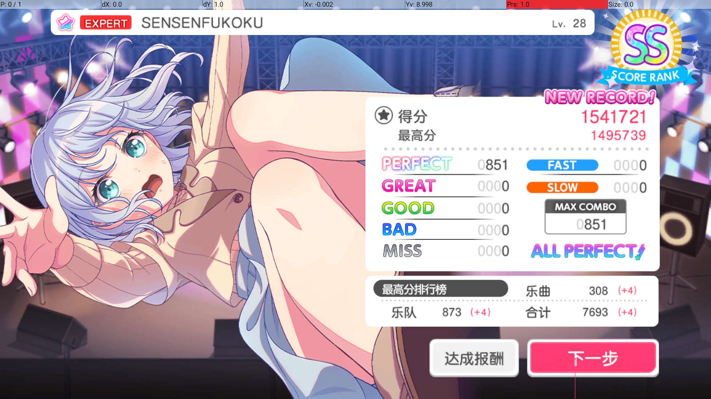

# Autodori  

A BanG Dream! helper

    

> Parts of this document are translated by machine or AI.

## ✨ Features

- [x] Auto-launch game and auto-play songs
- [x] Compatible with Windows, Mumu, and LDPlayer emulators
- [x] Optimized performance, low latency, and high accuracy
- [x] Usable with the Chinese server
- [ ] Auto-collect rewards and auto daily gacha x3
- [ ] Compatibility with Linux, macOS, and other emulators (awaiting other emulators to implement IPCAPI)
- [ ] Further accuracy and performance optimizations
- [ ] Support for Japanese and Global servers
- [x] Proof is in the pudding! 👇

  
*SP 六兆年と一夜物語 AP*

  
*EX ヒバナ-Reloaded- AP*

  
*EX SENSENFUKOKU AP*

## 🛠 How to Use

> [!IMPORTANT]  
> Before using this script, make sure the following prerequisites are met:
>
> 1. Ensure your device and emulator have sufficient performance
> 1. Set the emulator resolution to a 16:9 ratio, preferably (1600,900) or (1280,720)
> 1. Set the song list filter to “Normal” and it's recommended to clear any song filters
> 1. In the game’s “Performance Settings,” set the scroll speed to 8.0
> 1. In “Performance Effects & Volume Settings,” disable “3D Cut-in Mode” and set “Motion Mode” to “Lightweight”
> 1. For better experience, enable “FAST/SLOW Display” and “Perfect Status Display” in “Performance Effects & Volume Settings”
> 1. Connect to the emulator using adb

1. Download the latest release from [release](https://github.com/EvATive7/autodori/releases)  
2. Extract the archive and run `autodori.exe`
3. Use `autodori.exe -h` in the command line to see more options
4. You can edit `data/config.yml` to change configurations: [Config Example](./docs/config_eg/config.yml)

> [!NOTE]  
> If you understand code / need to tweak parameters or modify the code for better results / score optimization / testing or development, run from source:
>
> 1. `git clone --recursive https://github.com/EvATive7/autodori`  
> 2. `cd autodori`  
> 3. `python -m venv .venv`  
> 4. `.venv\Scripts\activate`  
> 5. `pip install -r requirements.txt`
> 6. Run `python build.py` (`build.py` will automatically organize and download necessary dependencies)

## ⚠️ Notes

1. It is recommended to use the latest version of Mumu emulator. It was tested less frequently on the lightning simulator and appeared to have performance issues.
1. The script is not complete yet and errors may occur. Welcome Issue and PR.

## 📝 License & Copyright

This project is open source under the GPLv3 license. Please follow the [project license](LICENSE) when modifying, copying, or distributing it.  
In addition to Python packages, this project directly includes, modifies, or distributes the following open source code, components, or binaries:

- [minitouch ver.EvATive7](https://github.com/EvATive7/minitouch) (Apache License 2.0)
- [MaaFramework](https://github.com/MaaXYZ/MaaFramework) (LGPLv3)
- [MaaYYS/build.py](https://github.com/TanyaShue/MaaYYs) (MIT)

This project distributes the following proprietary dynamic link libraries. These are not part of the open source project and are not covered by the project license:

- msvcp140.dll  
- vcruntime140.dll  
